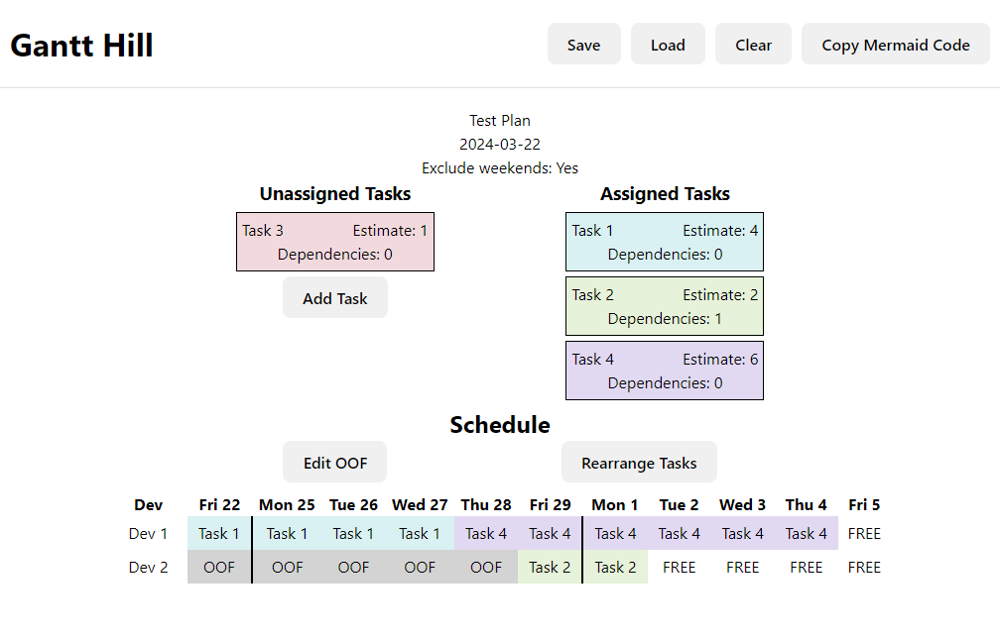

# Gantt Hill
## Overview
This is a simple app to schedule tasks across a set of workers, taking into account estimates, dependencies, and out of the office (OOF) days.

## Operation
Create tasks and set estimates and dependencies. Create your list of devs/workers using the "Add Dev" button. Then use the "Rearrange
Tasks" button to add the tasks to each dev's task list and rearrange them within those lists.

The data can be saved to JSON and reloaded from a JSON file created in this way. There's also a button to copy the current schedule 
as Mermaid gantt code.